# JetSon TX2 刷机&环境配置
## 1. 刷机
前期准备：配置一台系统为Ubuntu的电脑，Ubuntu系统版本要求为18.04或者16.04，磁盘空间最好大于80GB，运行内存大于8G，创建虚拟机时网络配置为桥接连接（方便后面将主机和板子连接在同一路由器下，配置网络），将该电脑作为主机（host）
使用软件：sdkmanager + Vmware
刷机版本：JetPack 4.6.6, Ubuntu18.04
### 1.1. 主机端环境配置
#### Ubuntu系统（主机）中安装sdkmanager
**1.sdkmanager下载**：https://developer.nvidia.com/sdk-manager
下载.deb文件即可，下载之前需要注册一个NVIDIA账号

**2.安装sdkmanager**
在host中使用linux命令安装sdkmanager_2.2.0-12021_amd64.deb(文件名称为所下载deb文件)

进入文件下载目录，右键当前文件目录选择在终端打开该文件，或者使用cd命令进入该目录下，进行软件安装，输入如下命令安装：

`sudo apt install ./sdkmanager_2.2.0-12021_amd64.deb  # 名称根据实际下载文件名称`

安装成功后启动该软件(或者直接在左下角找到已安装软件进入)

`sdkmanager`
### 1.2. TX2外设配置
首先连接tx2各个接口
.jpg)
1：电源接口
2：扩展usb口，刷机时需要使用官方自带的usb线连接主机和板子，不刷机时可以正常接外设
3：接外设用，比如键盘、鼠标
4：HDMI线，连接显示屏，官方推荐显示器和板子都使用HDMI连接
5：网线接口，这里我通过该接口将主机和板子连接在同一网络下（路由器）
#### 开始刷机
sdkmanager启动后，首先登录NVIDIA账号，随后将通过该软件进行刷机操作
.png)
.png)

##### STEP1
连接好板子和主机后，启动电源，即可开始刷机

选择需要刷机的板子型号：Jetson TX2
.png)
.png)
取消勾选Host Machine和DeepStream，JetPack选择4.6.6，点击CONTINUE进入下一步
##### STEP2
这里选择接受协议，其他默认，点击CONTINUE进入步骤3，开始下载包
.png)
##### STEP3
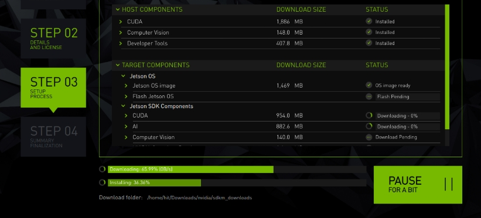
下载过程中弹出如下画面：
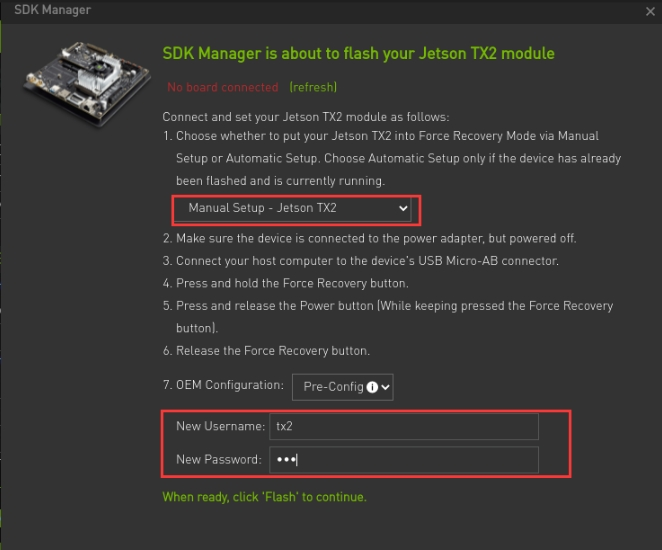
这里选择Manual Setup，设置新用户名和密码，我们将用户名设置为tx2，密码：nvidia

**设置板子为恢复模式：**
注：1：RST  3：REC  4:POWER
1.首先确认板子处于关机状态（若已经连接电源则拔掉关机），使用官方的microUSB线连接TX2和PC机
2.插上电源适配器，按一下power键开机
3.按下REC保持不要松开
4.一直按着REC时再按一下1:RST（RST按一下即可松开，REC此时依然按着）
5.REC保持两秒后再松开（这时候所有按键都松开了）
6.这时tx2进入恢复模式
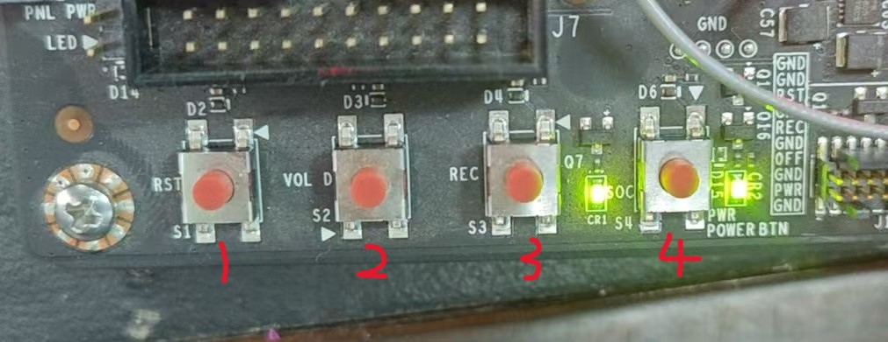
可以在主机终端中通过以下命令验证是否处于恢复模式：

`lsusb`

若在显示信息中出现 Nvidia Corp，就证明成功进入恢复模式，继续下一步安装

安装过程中如果出现如下界面或者出现安装失败的报错，此时可以使用在host中以终端命令的方式继续安装(新的JetPack4.6版本有问题，不用sdkmanager下载，使用命令下载安装)

```
cd ~/nvidia/nvidia_sdk/JetPack_4.6.6_Linux_JETSON_TX2_TARGETS/Linux_for_Tegra  # 进入安装目录下
sudo ./flash.sh jetson-tx2 mmcblk0p1
```
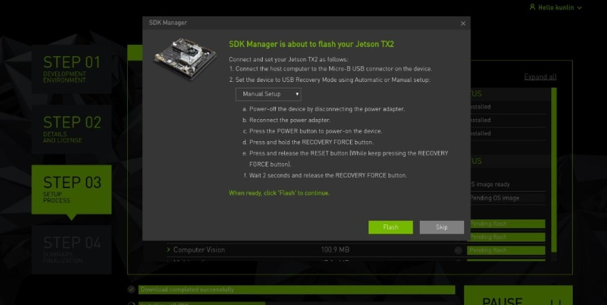
###### STEP4
等待安装完成即可，确保网络正常连接
### 1.3. TX2系统设置
刷机完成后可以通过连接在tx2上的显示器进入Ubuntu系统设置界面，这部分操作比较简单，只需要简单地配置系统时间，时区，账户等信息即可。
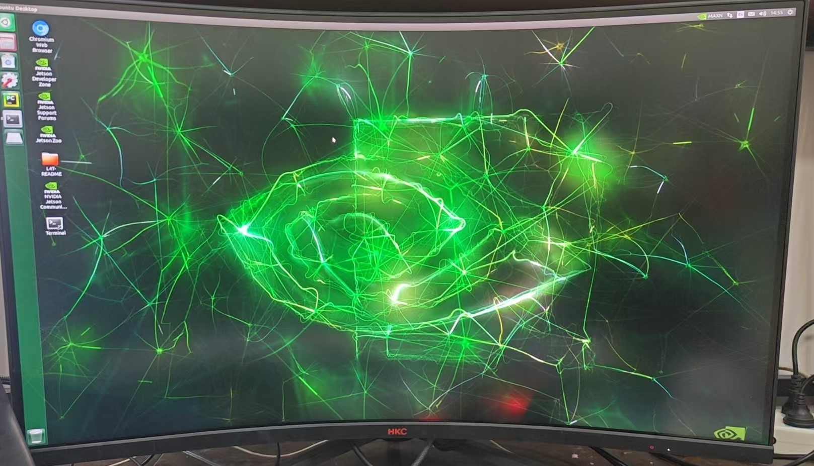
### 1.4. TX2更换清华镜像源（Ubuntu18.04）
- **备份**
  ```
  sudo cp /etc/apt/sources.list /etc/apt/sources.list.bak    #先备份原文件sources.list
  sudo rm /etc/apt/sources.list
  sudo vim /etc/apt/sources.list  #sudo打开sources.list
  ```
- **换源**
  - ubuntu-ports: Arm架构适用
  - bionic: ubuntu18
  ```
  # 默认注释了源码镜像以提高 apt update 速度，如有需要可自行取消注释
  deb https://mirrors.tuna.tsinghua.edu.cn/ubuntu-ports/ bionic main restricted universe multiverse
  # deb-src https://mirrors.tuna.tsinghua.edu.cn/ubuntu-ports/ bionic main restricted universe multiverse
  deb https://mirrors.tuna.tsinghua.edu.cn/ubuntu-ports/ bionic-updates main restricted universe multiverse
  # deb-src https://mirrors.tuna.tsinghua.edu.cn/ubuntu-ports/ bionic-updates main restricted universe multiverse
  deb https://mirrors.tuna.tsinghua.edu.cn/ubuntu-ports/ bionic-backports main restricted universe multiverse
  # deb-src https://mirrors.tuna.tsinghua.edu.cn/ubuntu-ports/ bionic-backports main restricted universe multiverse
  deb https://mirrors.tuna.tsinghua.edu.cn/ubuntu-ports/ bionic-security main restricted universe multiverse
  # deb-src https://mirrors.tuna.tsinghua.edu.cn/ubuntu-ports/ bionic-security main restricted universe multiverse
 
  ```
- **更新**
  ```
  sudo apt-get update
  sudo apt-get upgrade
  ```
## 2. TX2环境配置(cudn10.2, cudnn8.2.1, torch1.8.0, torchvision0.9.0, python3.6, OpenCV)
### 2.1. 安装cuda和cudnn
一般在刷机之后系统已经安装好cuda和cudnn，这里我碰到的问题是tx2上只有cuda10-2，并没有安装cudnn，cudnn需要我们手动下载
#### cuda
- **检查cuda是否存在：**
    进入/usr/local中，如果发现cuda-x.x的文件夹，则说明已经安装cuda，我刷机之后系统已经安装好cuda10.2
    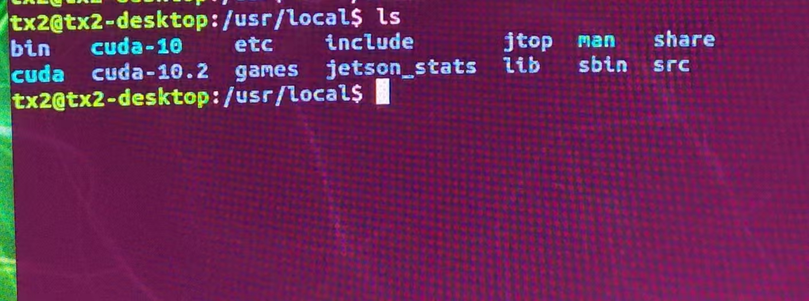
    如果没有找到cuda，也有可能是系统安装延迟，重新启动tx2或者稍等一会再查看是否有cuda，如果需要自己重新安装cuda，可以参考：https://blog.csdn.net/qq_30841655/article/details/120527741?spm=1001.2014.3001.5506

- **查看cuda版本**

    `nvcc -V  or cat /usr/local/cuda/version.txt`

    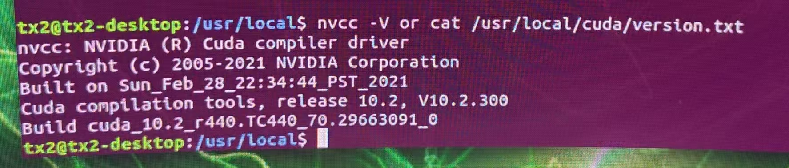
- **配置cuda系统环境变量**
```
    export PATH=/usr/local/cuda-10.2/bin:/usr/local/bin  
    export LD_LIBRARY_PATH=$LD_LIBRARY_PATH:/usr/local/cuda-10.2/lib64  
    export LIBRARY_PATH=$LIBRARY_PATH:/usr/local/cuda-10.2/lib64  
    export PATH=$PATH:/usr/local/cuda-10.2/lib64
```
#### cudnn
**注意：JETSON TX2上安装的CUDNN,一定要是ARM版本的(即AARCH64)**
直接在nvidia官网上下载的cudnn均不是基于ARM架构，我们可以通过刷机过程中下载的sdkmanager软件找到我们需要的cudnn安装包，在host中进入下载目录：`/home/Downloads/nvidia/sdkm_downloads`
+ 搜索`libcudnn`找到如下三个文件，将这些文件拷贝到tx2系统上
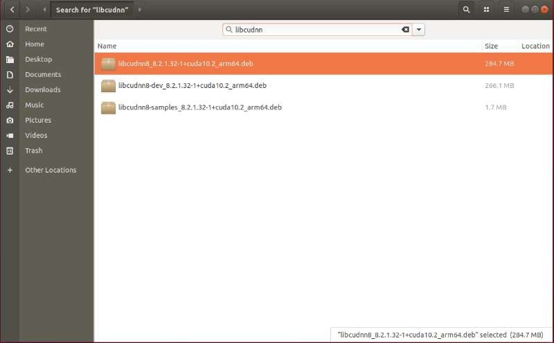
+ 在JetSon TX2上安装cudnn
```
sudo dpkg -i libcudnn8_8.2.1.32-1+cuda10.2_arm64.deb
sudo dpkg -i libcudnn8-dev_8.2.1.32-1+cuda10.2_arm64.deb
sudo dpkg -i libcudnn8-samples_8.2.1.32-1+cuda10.2_arm64.deb
sudo ldconfig
```
+ **查看cudnn版本**
  `cat /usr/include/cudnn_version.h | grep CUDNN_MAJOR -A 2`
  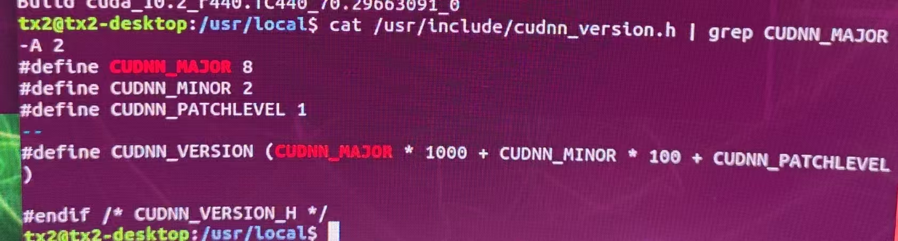
### 2.2. 安装conda、openjdk-11-jdk、pycharm（可选）
注：conda和pycharm不是必须安装的，只是为了更好地管理环境和编译代码，也可以选择在终端使用命令运行代码，在tx2上安装pycharm之前必须先安装jdk-11
#### conda
- **安装aarch64conda**
    由于Jetson tx2是aarch64架构，在aconda官网上下载的不能使用，这里我们需要下载支持aarch64架构的conda：   https://github.com/Archiconda/build-tools/releases
    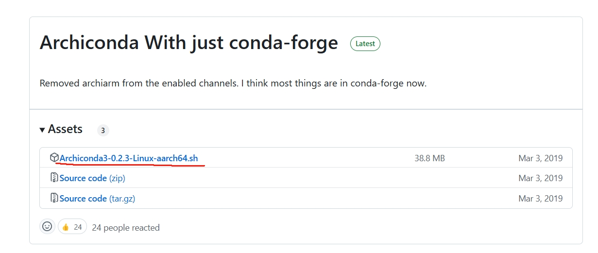
    点击红色横线部分进行下载，这里我选择的是 `Archiconda3-0.2.3-Linux-aarch64.sh`
    下载后进行安装：
    ```
    chmod +x Archiconda3-0.2.3-Linux-aarch64.sh  # 修改.sh文件权限为可执行
    ./Archiconda3-0.2.3-Linux-aarch64.sh
    source ~/tx/.bashrc
    ```
- **配置环境变量**
  ```
  sudo gedit ~/.bashrc
  ```
  在文档最后一行添加：
  ```
  export PATH=~/archiconda3/bin:$PATH
  ```
- **conda换源**
  查看当前源：
  ```
  conda config --show-sources
  ```
  配置清华源
  ```
  conda config --add channels https://mirrors.tuna.tsinghua.edu.cn/anaconda/pkgs/free/
  conda config --add channels https://mirrors.tuna.tsinghua.edu.cn/anaconda/cloud/conda-forge 
  conda config --add channels https://mirrors.tuna.tsinghua.edu.cn/anaconda/cloud/msys2/
  conda config --add channels https://mirrors.tuna.tsinghua.edu.cn/anaconda/cloud/pytorch/
  ```
- **安装pip**
  ```
  sudo apt-get update
  sudo apt-get upgrade
  sudo apt-get dist-upgrade
  sudo apt-get install python3-pip libopenblas-base libopenmpi-dev
  pip3 install --upgrade pip
  ```
- **创建环境**
    ```
    $ conda create -n torch python=3.6
    ```
    我已经创建好了名为torch的conda环境，python版本为3.6
- **激活环境**
    ```
    $ conda activate torch
    ```
    以后安装包的时候都可以选择在创建的虚拟环境中进行安装
#### openjdk-11-jdk
- **安装命令**
  ```
  sudu apt-get install openjdk-11-jdk
  ```
- **验证**
  ```
  java -version
  ```
  出现版本号即安装成功
  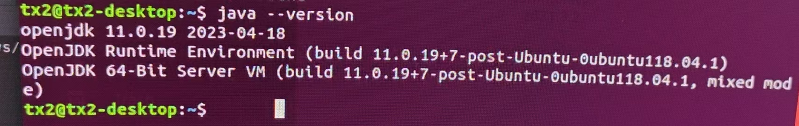
#### pycharm
- **下载**
  pycharm官网   https://www.jetbrains.com/zh-cn/pycharm/download/other.html
  在官网下载pycharm Linux社区版，我下载的版本为：pycharm-community-2021.3.2
  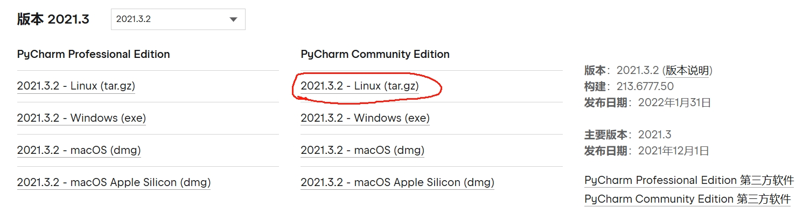
  下载后解压，在文件夹中找到启动文件`~/pycharm-community-2021.3.2/bin/pycharm.sh`
  终端命令执行sh
  ```
  chmod +x pycharm.sh
  ~/pycharm-community-2021.3.2/bin/pycharm.sh
  ```
  安装好pycharm之后可能出现无法找到快捷启动方式的情况，可以在打开pycharm的同时右键pycharm图标固定到启动栏
  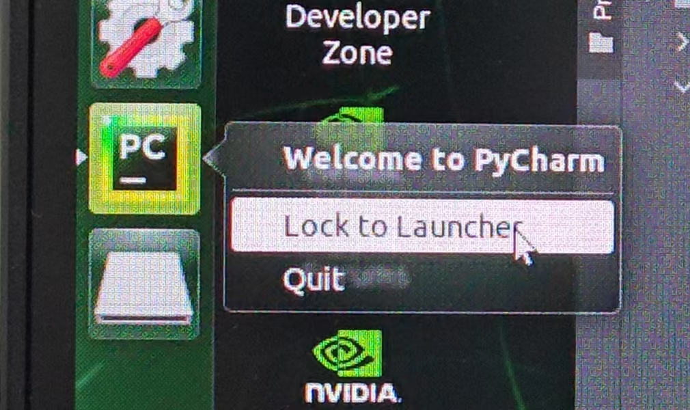
### 2.3. 安装torch和torchvision(可以选择在conda新建虚拟环境以下操作均在该环境中执行)
#### torch
安装pytorch需要先确定安装方式和版本，最好采用离线安装方式：在主机下载好安装包，用U盘拷到板卡中再安装，版本的话需要看你要移植的程序的需求，一般项目文件夹都会有一个名字为requirements.txt的文件，打开它可以看到程序需要的各种库和版本，这里我使用的模型为yolov5-7.0
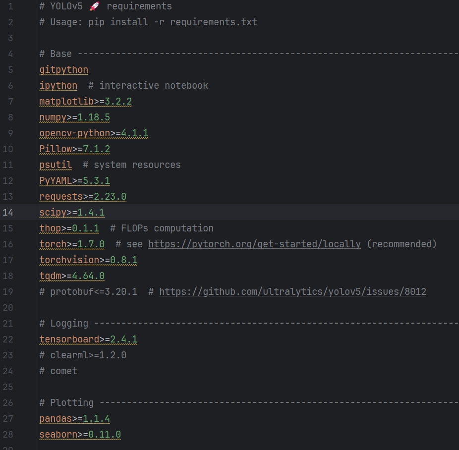
要求torch >= 1.7.0,torchvision >= 0.8.1
同时，pytorch需要和下载的jetpack版本对应,pytorch官网链接：
https://forums.developer.nvidia.com/t/pytorch-for-jetson/72048
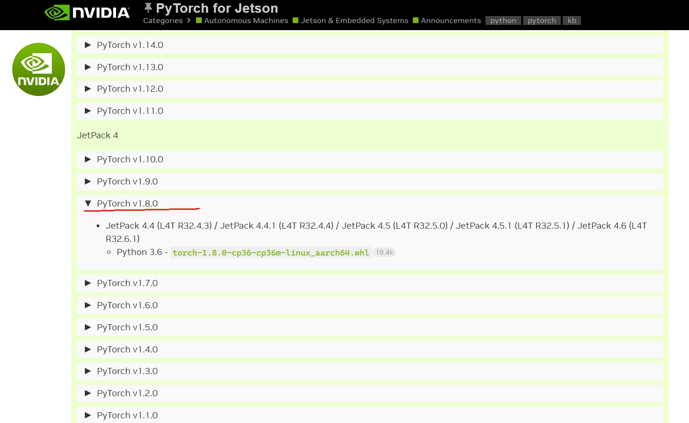
可以看到pytorch1.8.0支持jetpack4.6
这里我选择的是torch 1.8.0，点击whl即可下载
下载好之后拷贝到tx2上，执行以下命令：
```
sudo apt-get install python3-pip libopenblas-base libopenmpi-dev 
pip3 install Cython
pip3 install numpy 
pip3 install torch-1.8.0-cp36-cp36m-linux_aarch64.whl #离线安装包名字
```
安装完成后可以在当前环境中使用`pip list`命令查看是否安装成功
#### torchvision
torchvison版本需要和torch以及python版本对应
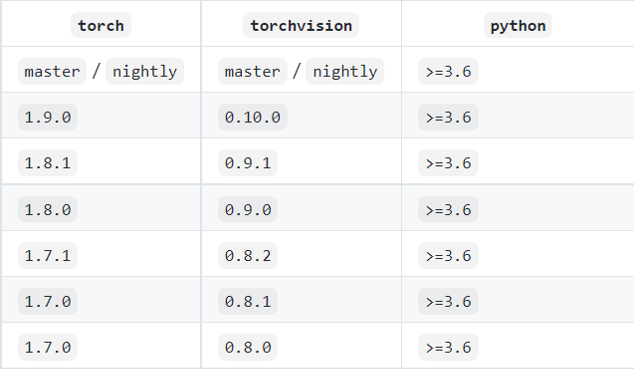
这里我选择的是torchvision 0.9.0，下载链接：
https://download.pytorch.org/whl/torch_stable.html
下载链接进不去也可以使用我提供的百度网盘：
链接: https://pan.baidu.com/s/18okpFc3p_wyiduFunwWe6w?pwd=1111 
提取码: 1111
下载好的文件名称为：`torchvision-0.9.0a0+01dfa8e-cp36-cp36m-linux_aarch64.whl`
运行安装：
`pip install torchvision-0.9.0a0+01dfa8e-cp36-cp36m-linux_aarch64.whl`
使用pip list命令查看包信息

### 2.4. 安装OpenCV
opencv的安装可以参考以下链接：
https://blog.csdn.net/weixin_45306341/article/details/127926178?spm=1001.2014.3001.5506
## 3. YOLO推理
这里我使用的yolov5-7.0
根据requirements.txt 文件确定自己需要安装的包

如果已经安装好torch和torchvision并且满足版本要求可以将其注释掉，以免安装其他版本
通过requirements.txt安装环境：
`pip install -r requirements.txt`
安装完成之后使用以下代码验证torch和cuda，
```
import torch
import torchvision

print(torch.__version__)
print(torchvision.__version__)
print(torch.cuda.is_available)
print(torch.version.cuda)
print(torch.backends.cudnn.version)
```
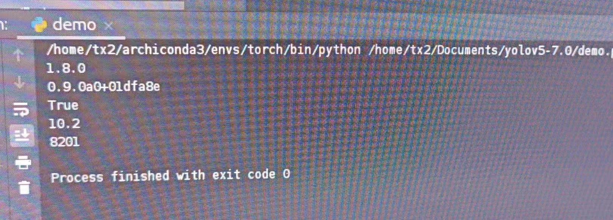
运行yolov5-7.0中的detect.py验证环境
**注意：**
运行 yolov5 的 detect.py 时，会有一个检查安装包的版本的函数check_requirements ，很多安装包需要很新的版本，这里建议把这个函数注释掉。
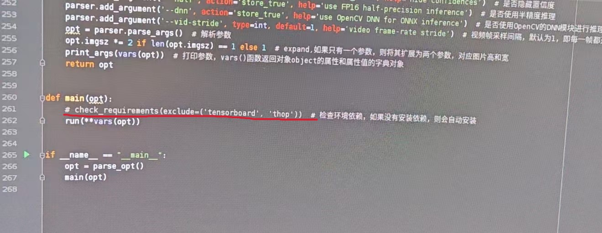
出现以下信息即为配置成功
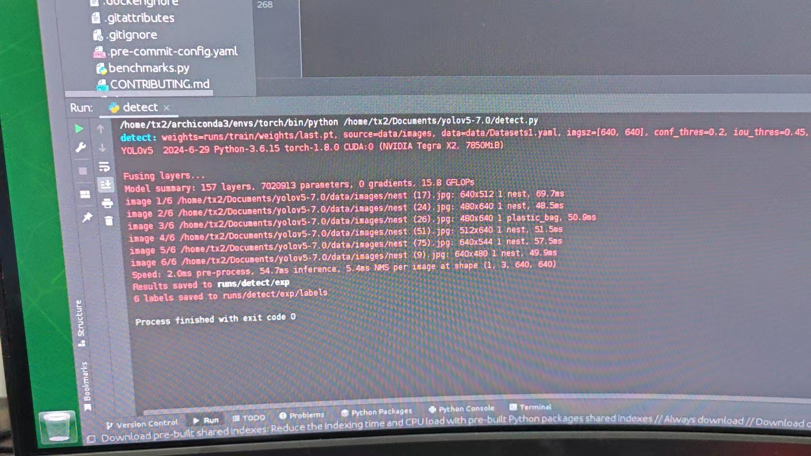
可能出现的报错：
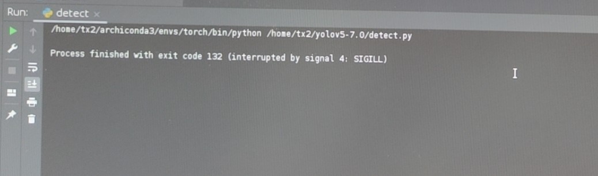
这里我出现这个问题的原因是安装的numpy 1.19.5版本不支持aarch64架构，故换版本为1.19.0
`pip install numpy==1.19.0`
检测结果：
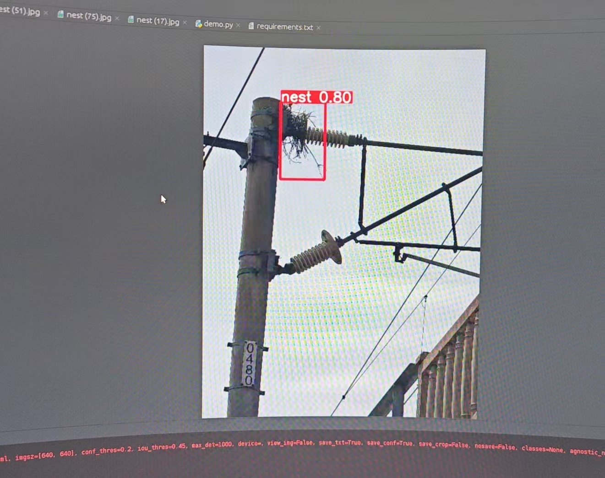
